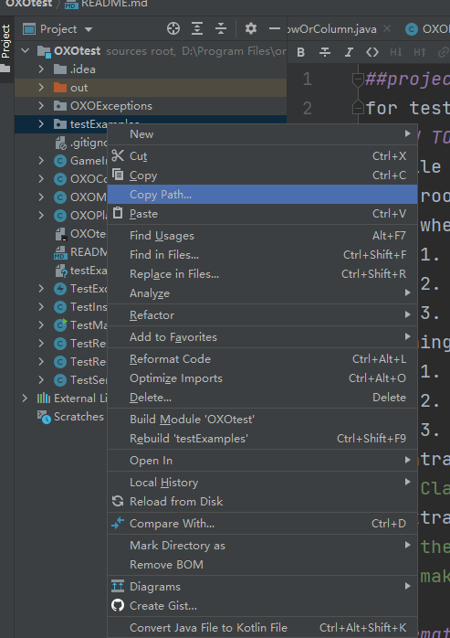

## project usage

for test OXO coursework, with 19 test examples(till 25/2/2021)

## how to use this

1. file structure
   - root: OXOtest
   - where to place your file:
   > 1. put OXOController.java and OXOModel.java under root
   > 2. put OXOExceptions folder under root 
   > 3. make sure inside there are .java files instead of .class file
2. things to change
   > 1. inside TestInstanceReader line 11, replace the path with the absolute path of testExamples folder,
   > 2. inside TestResultWriter line 8, replace the path with where you want the report.txt to be
   > 3. you should be able to easily get it use idea, right mouse click on the folder
   > 
3. entrance
   
   > Class TestMain, you can run main function there
4. extra attention
   > the test file was written in java8, so any extension grammar might
   > make the compiling fail, try not to use these grammar
   

## format of test example

   >- Format of head(first line) : 
   >TestNum | Row | Column | winThreshold | NumberOfPlayers | NumberOFWinner(-2 for gameDrawn,-1 for Exception, >0 for index of winner) | (optional)ExceptionType
   >- Format of body :normally:[a-iA-I][1-9]
   >- for customize test example: always put one space for each string, no space at the end of the line
## donate if you find it useful(1RMB for each report)
   >
## possible extension
   >1. shell script can be used if there are a lot of code to test
   >2. reflection may be useful for test .class file
## if you want to read my code
   >1. TestService is where the main logic happens
   >2. there are a reader class and a writer class, dealing with file input/output
## recruit
   >If you are interested in automatic test, join me for the next 2 coursework,
   >it should be a lot of fun.
   >
   >- my bristol account: oh20840. Email or Teams chat should all work.
